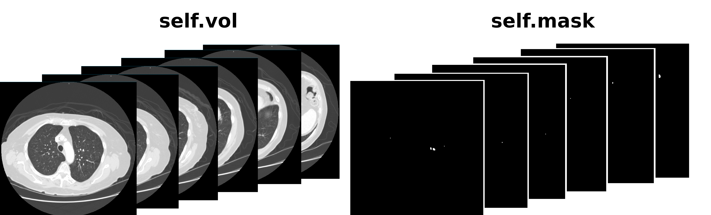
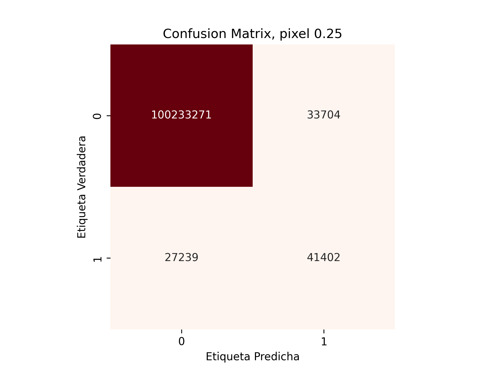
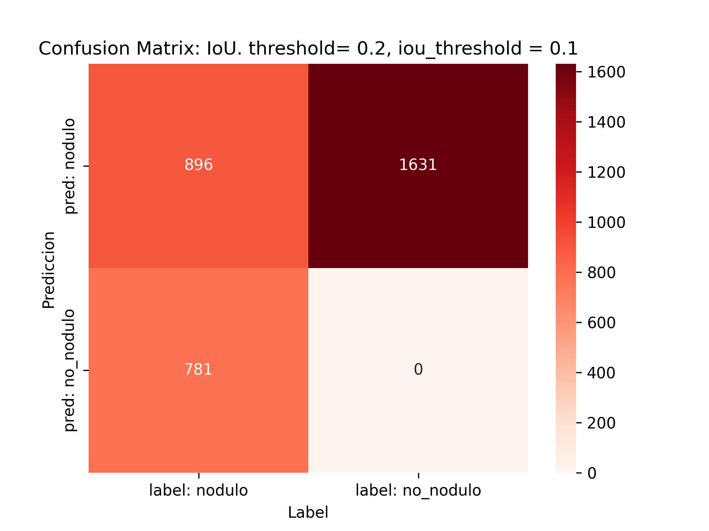
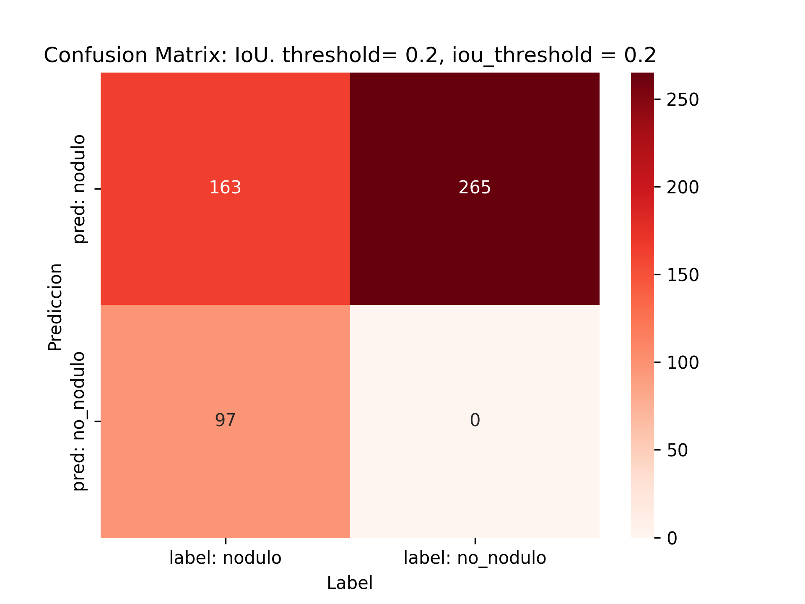
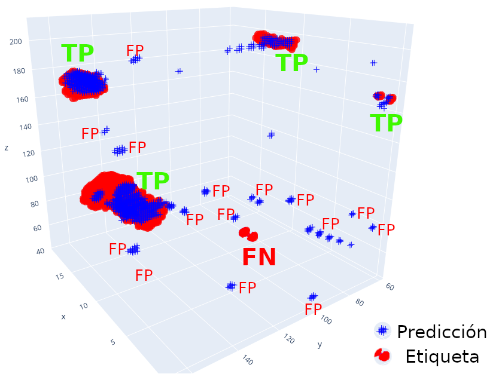

# processLIDC
En este repo se incluyen metodos para la carga, procesado, visualizacion y transformación del dataset LIDC-IDRI para enternar una UNet de pytorch.

## USAGE:

Para que la clase `Patient` (o incluso sin ella) pueda acceder a un paciente de LIDC es necesario:

1. Tener descargado uno o varios pacientes.

2. La libreria de `pylidc` que realiza las queries ira a mirar a la ruta indicada en el archivo oculto:
```
   /home/abel/.pylidcrc
   ```
   En ella hay que indicar:

   ```
   path = /home/abel/TFM/manifest-1675801116903/LIDC-IDRI
   ```

   De tal forma que el comando proporcione lo siguiente: 
   ```
   ls /home/abel/TFM/manifest-1675801116903/LIDC-IDRI

   OUTPUT: LIDC-IDRI-0002  LIDC-IDRI-0005
   ... 
   ```


3. Clonar el repositorio:
```
git clone https://github.com/abelBEDOYA/processLIDC
```

## Uso de la clase `Patient()`:

Instanciar la clase con `patient = Patient(id_patient)` con `id_patient="LIDC-IDRI-134"`.

- Estandarización de los valores las imagenes y procesado de etiquetas para obtener mascaras.



- Ejemplos de visualización y prediccion del modelo:

`patient.imshow(slices=(67,), labels=True, model=model_loaded)`


`patient.reconstruct_body(mask=True)`


## Entrenamiento

Ejecutar:
```
launch_training.sh
```
Contiene el comando: `python3 train.py --n_epochs 2 --batch_size 3 --val_split 0.5 --path2dataset '../../manifest-1675801116903/LIDC-IDRI/' --path2savefiles '../' --plot_metrics --save_plots --save_epochs 2 --model_extension '.pt' --loss_type 1
`
Lanza el enterno de la UNet proporcionando los pesos `.pt` y los plots del avance del entrenamiento.


## Validación 2D píxeles:


Ejecutar:
```
get_matrix_pixel.sh
```
Contiene el comando: `python3 matrix_pixel.py --val --model "./finalmodel.pt" --save './'  --path2dataset '../../manifest-1675801116903/LIDC-IDRI/' --valsplit 0.1 --batch 10`
Valida el modelo indicado calculando la matriz de confusión




## Validación 2D detección:


Ejecutar:
```
get_matrix2d.sh
```
Contiene el comando: `python3 matrix2d.py --val --model "../trainings/training_wbce/model-epoch10.pt" --save './'  --path2dataset '../../manifest-1675801116903/LIDC-IDRI/' --valsplit 0.1 --batch 10 --threshold 0.1`
Valida el modelo indicado calculando la matriz de confusión de detección de cada slice 2d basándose en la IoU



## Validación 3D detección:


Ejecutar:
```
get_matrix2d.sh
```
Contiene el comando: `python3 matrix3d.py --val --model "../trainings/training_wbce/model-epoch10.pt" --save './'  --path2dataset '../../manifest-1675801116903/LIDC-IDRI/' --valsplit 0.1 --batch 10 --threshold 0.1`
Valida el modelo indicado calculando la matriz de confusión a partir del volumen en 3d basándose en la IoU







