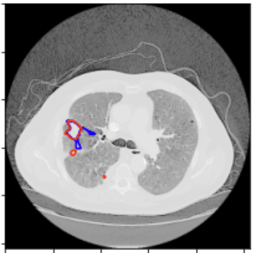
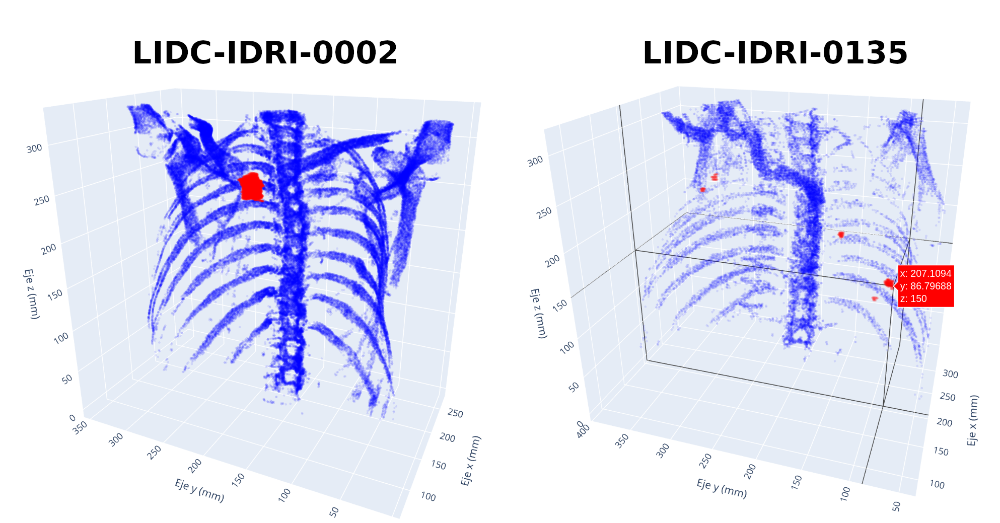

# processLIDC
En este repo se incluyen metodos para la carga, procesado, visualizacion y transformación del dataset LIDC-IDRI para enternar una UNet de pytorch.

## USAGE:

Para que la clase `Patient` (o incluso sin ella) pueda acceder a un paciente de LIDC es necesario:

1. Tener descargado uno o varios pacientes.

2. La libreria de `pylidc` que realiza las queries ira a mirar a la ruta indicada en el archivo oculto:
```
   /home/abel/.pylidcrc
   ```
   En ella hay que indicar:

   ```
   path = /home/abel/TFM/manifest-1675801116903/LIDC-IDRI
   ```

   De tal forma que el comando proporcione lo siguiente: 
   ```
   ls /home/abel/TFM/manifest-1675801116903/LIDC-IDRI

   OUTPUT: LIDC-IDRI-0002  LIDC-IDRI-0005
   ... 
   ```


3. Clonar el repositorio:
```
git clone https://github.com/abelBEDOYA/processLIDC
```

## Uso de la clase `Patient()`:

Instanciar la clase con `patient = Patient(id_patient)` con `id_patient="LIDC-IDRI-134"`.

- Estandarización de los valores las imagenes y procesado de etiquetas para obtener mascaras.


- Ejemplos de visualización y prediccion del modelo:

`patient.imshow(slices=(67,), labels=True, model=model_loaded)`


`patient.reconstruct_body(mask=True)`



